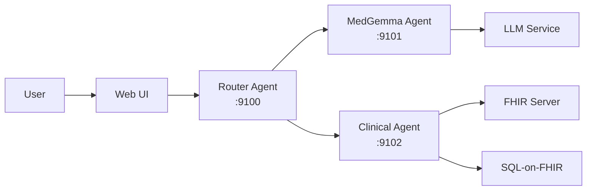

# 🏥 Medical Multi-Agent Chat System

> **Production-ready A2A protocol implementation for collaborative medical AI** - Three specialized agents working together to answer complex medical questions using the official [Agent-to-Agent (A2A) SDK](https://github.com/a2aproject/a2a-samples).

[](https://www.python.org/downloads/)
[](https://github.com/a2aproject/a2a-python)
[](LICENSE)

## ✨ What Makes This Special?

This isn't just another chatbot - it's a **collaborative AI system** where specialized medical agents work together:

- 🧬 **MedGemma Agent** - Medical Q&A expert using Google's MedGemma model
- 🔬 **Clinical Research Agent** - Queries FHIR databases and synthesizes patient data
- 🧭 **Router Agent** - Intelligently orchestrates requests to the right specialist

Built on the **official A2A protocol**, these agents can discover each other, communicate seamlessly, and even integrate with external A2A-compliant agents worldwide.

## 🚀 Quick Start (2 minutes)

```bash
# 1. Clone and setup
git clone <repo>
cd projects/multiagent_chat
poetry install

# 2. Configure LM Studio endpoint (just 1 line!)
cp env.example .env
echo "LLM_BASE_URL=http://localhost:1234" >> .env

# 3. Launch all agents
poetry run python launch_a2a_agents.py

# 🎉 Open http://localhost:8080 and start chatting!
```

## 🏗️ Architecture



Each agent is a standalone microservice following the A2A protocol:
- **Protocol**: JSON-RPC 2.0 over HTTP
- **Discovery**: Agent cards with skill definitions
- **Type Safety**: Full Pydantic validation
- **Async**: Built on FastAPI/ASGI

## 📚 Documentation

### Getting Started
- [**Installation Guide**](docs/getting-started/installation.md) - Dependencies and setup
- [**Quick Start Tutorial**](docs/getting-started/quick-start.md) - Your first medical query
- [**Configuration**](docs/getting-started/configuration.md) - LLM providers, FHIR setup

### Architecture & Design
- [**System Overview**](docs/architecture/overview.md) - How it all works
- [**Agent Capabilities**](docs/architecture/agents.md) - What each agent does
- [**Data Flow**](docs/architecture/data-flow.md) - Message routing explained

### Development
- [**Creating New Agents**](docs/development/creating-agents.md) - Build your own specialist
- [**Testing Guide**](docs/development/testing.md) - Unit and integration tests
- [**API Reference**](docs/development/api-reference.md) - Protocol details

### Deployment
- [**Docker Deployment**](docs/deployment/docker.md) - Containerized setup
- [**Monitoring**](docs/deployment/monitoring.md) - Health checks and logging

## 🎯 Example Queries

Try these to see the agents in action:

```
"What are the symptoms of diabetes?"
→ Routes to MedGemma for medical knowledge

"Show me recent blood pressure readings for patients"
→ Routes to Clinical Agent for FHIR data

"What medications are used for hypertension?"
→ Routes to MedGemma for treatment information

"Generate a report of diabetic patients in facility F001"
→ Routes to Clinical Agent with facility scope
```

## 🛠️ Key Features

- ✅ **True A2A Protocol** - Not a simulation, real protocol implementation
- ✅ **Microservices Architecture** - Each agent runs independently
- ✅ **Multiple LLM Support** - LM Studio, OpenAI, Gemini, Ollama
- ✅ **FHIR Integration** - OpenMRS, HAPI FHIR, SQL-on-FHIR
- ✅ **Type-Safe** - Pydantic models throughout
- ✅ **Production Ready** - Docker, health checks, logging
- ✅ **Extensible** - Easy to add new agents

## 🤝 Contributing

We welcome contributions! Here's how to get started:

### Add a New Agent
```python
from a2a import Agent
from a2a.decorators import skill

class MyAgent(Agent):
    @skill("my_skill")
    async def my_skill(self, query: str) -> dict:
        # Your implementation
        return {"answer": "..."}
```

See our [Creating Agents Guide](docs/development/creating-agents.md) for details.

### Development Setup
```bash
# Install with dev dependencies
poetry install --with dev

# Run tests
pytest

# Format code
black . && isort .
```

## 🔗 References

- [A2A Protocol Specification](https://a2aprotocol.ai)
- [A2A Python SDK](https://github.com/a2aproject/a2a-python)
- [A2A Samples](https://github.com/a2aproject/a2a-samples)
- [Google MedGemma](https://ai.google.dev/gemma/docs/medgemma)
- [OpenMRS FHIR](https://openmrs.org/fhir)

## 📄 License

MIT License - See [LICENSE](LICENSE) for details.

## 🙏 Acknowledgments

Built with:
- [A2A Protocol](https://a2aprotocol.ai) by the A2A Project team
- [MedGemma](https://ai.google.dev/gemma) by Google
- [FastAPI](https://fastapi.tiangolo.com/) by Sebastián Ramírez
- [FHIR](https://hl7.org/fhir/) by HL7

---

<p align="center">
  <i>Building the future of collaborative medical AI, one agent at a time.</i>
</p>